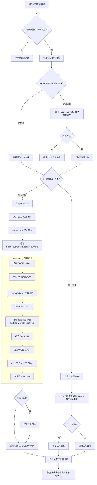
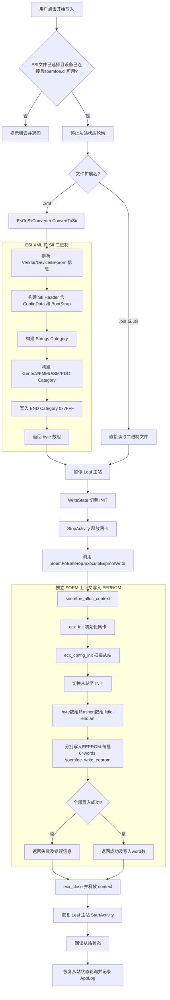

# 烧录流程图预览

## FoE 固件烧录流程

```mermaid
flowchart TD
    A[用户点击开始烧录] --> B{文件已选择且设备已连接?}
    B -->|否| B1[提示错误并返回]
    B -->|是| C[停止从站状态轮询]
    C --> D{IsPreProcessedFirmware?}
    D -->|已签名| E1[直接读取 bin 文件]
    D -->|原始固件| E2[调用 pack_ota.py 进行OTA打包签名]
    E2 --> E3{打包成功?}
    E3 -->|否| E3F[提示 OTA 打包失败]
    E3 -->|是| E4[读取签名后文件]
    E1 --> F{soemfoe.dll 可用?}
    E4 --> F

    F -->|是 方案A| G[暂停 Leal 主站]
    G --> G1[WriteState 切至 INIT]
    G1 --> G2[StopActivity 释放网卡]
    G2 --> H[调用 SoemFoEInterop.ExecuteFoEWrite]

    subgraph FoEDLL [soemfoe.dll 内部流程]
        H1[分配 SOEM context] --> H2[ecx_init 初始化网卡]
        H2 --> H3[ecx_config_init 扫描从站]
        H3 --> H4[切换从站至 INIT]
        H4 --> H5[读取 Bootstrap 邮箱 EEPROM 0x0014/0x0016]
        H5 --> H6[编程 SM0/SM1]
        H6 --> H7[切换从站至 BOOT]
        H7 --> H8[ecx_FOEwrite 文件写入]
        H8 --> H9[关闭释放 context]
    end

    H --> H1
    H9 --> I{FoE 成功?}
    I -->|是| J1[恢复 Leal 主站 StartActivity]
    I -->|否| J2[记录失败日志]
    J2 --> J1
    J1 --> K[更新状态并保存设置]

    F -->|否 方案B| L[切换从站至 INIT]
    L --> M[SDO 分段传输 对象0xF010 每段480字节]
    M --> N{SDO 成功?}
    N -->|是| O1[恢复从站状态]
    N -->|否| O2[记录失败日志]
    O1 --> K
    O2 --> K

    K --> Z[恢复从站状态轮询并记录 AppLog]
```

## ESI XML EEPROM 烧录流程

```mermaid
flowchart TD
    A[用户点击开始写入] --> B{ESI文件已选择且设备已连接且soemfoe.dll可用?}
    B -->|否| B1[提示错误并返回]
    B -->|是| C[停止从站状态轮询]
    C --> D{文件扩展名?}

    D -->|.xml| E1[EsiToSiiConverter.ConvertToSii]
    D -->|.bin 或 .sii| E2[直接读取二进制文件]

    subgraph ESIConvert [ESI XML 转 SII 二进制]
        X1[解析 Vendor/Device/Eeprom 信息] --> X2[构建 SII Header 含 ConfigData 和 BootStrap]
        X2 --> X3[构建 Strings Category]
        X3 --> X4[构建 General/FMMU/SM/PDO Category]
        X4 --> X5[写入 END Category 0x7FFF]
        X5 --> X6[返回 byte 数组]
    end

    E1 --> X1
    X6 --> F
    E2 --> F

    F[暂停 Leal 主站] --> F1[WriteState 切至 INIT]
    F1 --> F2[StopActivity 释放网卡]
    F2 --> G[调用 SoemFoEInterop.ExecuteEepromWrite]

    subgraph EEPROMWrite [独立 SOEM 上下文写入 EEPROM]
        G1[soemfoe_alloc_context] --> G2[ecx_init 初始化网卡]
        G2 --> G3[ecx_config_init 扫描从站]
        G3 --> G4[切换从站至 INIT]
        G4 --> G5[byte数组转ushort数组 little-endian]
        G5 --> G6[分批写入EEPROM 每批64words soemfoe_write_eeprom]
        G6 --> G7{全部写入成功?}
        G7 -->|否| G8[返回失败及错误信息]
        G7 -->|是| G9[返回成功及写入word数]
    end

    G --> G1
    G8 --> H
    G9 --> H

    H[ecx_close 并释放 context] --> I[恢复 Leal 主站 StartActivity]
    I --> J[回读从站状态]
    J --> K[恢复从站状态轮询并记录 AppLog]
```
